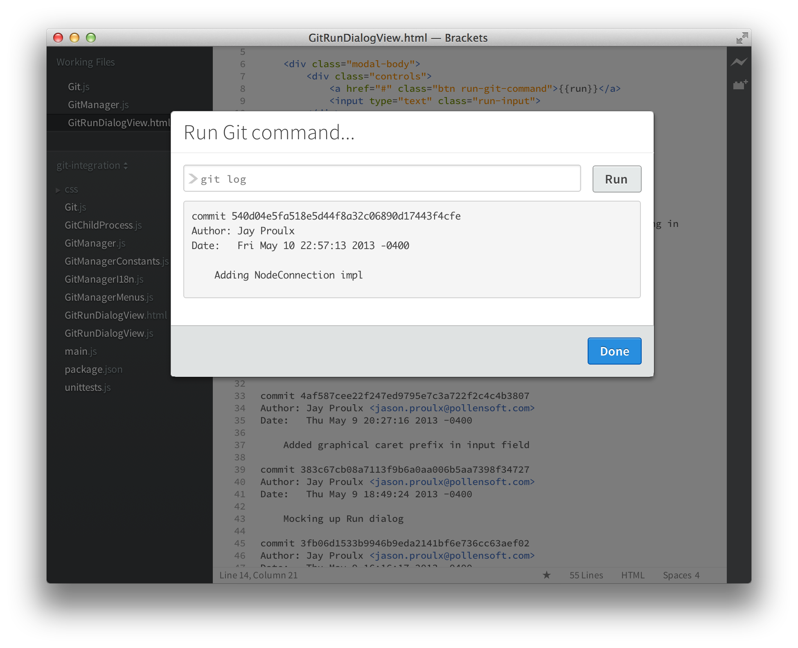

git-integration
===============

Tested against Brackets Sprint 24

Current state:
--------------

* git-integration assumes you have a .git repo in your project root folder
* Git repo isn't in your root folder?  No problem!  Just open the folder with your Git repo in it :) 

Next Milestone: Milestone 2
---------------------------

* File context menu: Git > Add, Move, Delete
* Git Run... key binding
* Sidebar icon: Git Commit (and prompt for message)
* Sidebar icon: Git push (origin master) // lets not get too fancy!

For later:
----------

* Multiple repos
* Configurable repo location

Command line Git integration for Brackets.
